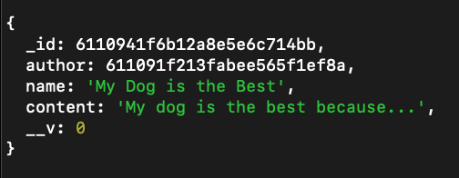
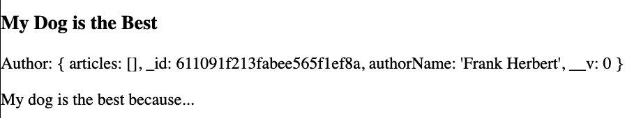
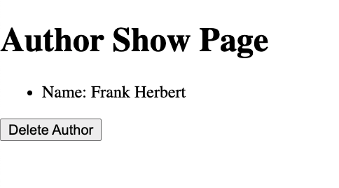
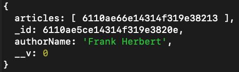
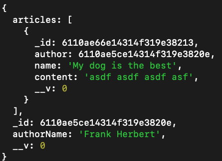

# Creating A Relationship Between Two Models

## Lesson Objectives

1. Learn about the different types of relationships in data
2. Create a relationship between our Author and our Article model
3. Display the Author's name on the Article Show page
4. On the Author Show page, display a list of articles they have written

<!-- 1. Add Articles Array to Author Model
1. Display Authors on New Article Page
1. Creating a new Article Pushes a Copy Onto Author's Articles Array
1. Display Author With Link on Article Show Page
1. Display Author's Articles With Links On Author Show Page
1. Deleting an Article Updates An Author's Articles List
1. Updating an Article Updates An Author's Articles List
1. Deleting an Author Deletes The Associated Articles
1. Change Author When Editing an Article -->


### Numerical Categories for Relationships

### One-to-One

Each person has one brain, and each (living human) brain belongs to one person.


One-to-one relationships can sometimes just be modeled with simple attributes. A person and a brain are both complex enough that we might want to have their data in different models, with lots of different attributes on each.

### One-to-Many

Each leaf "belongs to" the one tree it grew from, and each tree "has many" leaves.


### Many-to-Many

Each student "has many" classes they attend, and each class "has many" students.


#### Entity Relationship Diagrams

Entity relationship diagrams (ERDs) represent information about the numerical relationships between data, or entities.


Note: In the example above, all of the Item1, Item2, Item3 under each heading are standing in for attributes.

[More guidelines for ERDs](http://docs.oracle.com/cd/A87860_01/doc/java.817/a81358/05_dev1.htm)

#### Check for Understanding

Come up with an example of related data.  Draw the ERD for your relationship, including a few attributes for each model.

### Association Categories for Mongoose

**Embedded Data** is directly nested *inside* of other data. Each record has a copy of the data.


It is often *efficient* to embed data because you don't have to make a separate request or a separate database query -- the first request or query gets you all the information you need.  


**Referenced Data** is stored as an *id* inside other data. The id can be used to look up the information. All records that reference the same data look up the same copy.


It is usually easier to keep referenced records *consistent* because the data is only stored in one place and only needs to be updated in one place.  


[Source: MongoDB docs](https://docs.mongodb.com/v3.2/tutorial/model-referenced-one-to-many-relationships-between-documents/)


While the question of one-to-one, one-to-many, or  many-to-many is often determined by real-world characteristics of a relationship, the decision to embed or reference data is a design decision.  

There are tradeoffs, such as between *efficiency* and *consistency*, depending on which one you choose.  

When using Mongo and Mongoose, though, many-to-many relationships often involve referenced associations, while one-to-many often involve embedding data.


### Relevant Documentation

1. [Populate](https://mongoosejs.com/docs/populate.html)


# Code Along Activity

For today's activity, we'll be using **Referenced Data** to create a relationship between our authors and our articles.

Our two main features are
1. To be able to view an Article and see the Author for that Article.
2. To be able to view an Author and see a list of Articles that Author has written.

---
## Add an Author Property to the Article Schema

We'll start by updating the Article Schema, to accomodate storing an Author information.

In `./models/Article.js`
```js
const articleSchema = new mongoose.Schema({
    name: { type: String, required: true },
    content: String,
    author: {
        type: mongoose.Schema.Types.ObjectId,
        ref: 'Author'
    }
});
```

Here, we add an author property to the Article Schema, and define it as an **Object Id**. In Mongo DB, every record has a unique **Object Id** that identifies it in the collection. By storing the **Object Id** of the author we are storing a reference to the author.

Now when creating an article, it will look something like this.

```js
{
  name: 'Top 10 Best Recipes of 2021',
  content: 'If you are looking for tasty recipe you\'ve come to the right place...',
  author: ObjectId('611088372d0f1edf1f6fce78')
}
```

## Add Author Selection on Article New Page

Now when visiting our form to add a new Article, we want to be able to select which Author wrote that article.

In `./views/articles/articlesNew.ejs` we'll add an HTML select box, with an option for each author

First check out the documentation for the [HTML Select Box](https://developer.mozilla.org/en-US/docs/Web/HTML/Element/select) to get a sense for how it works.

```html
<form action="/articles" method="POST">
  
  <label for="author">Author: </label>

  <select name="author" id="author">
    <% for (let i = 0; i < allAuthors.length; i++) { %>
        <option value="<%= allAuthors[i]._id %>">
            <%= allAuthors[i].authorName %>
        </option>
    <% } %>
  </select>

  <div>
    <label for="name">Name of Article:</label>
    <input type="text" name="name">
  </div>

  <div>
    <label for="content">Article Content:</label>
    <textarea type="text" name="content"></textarea>
  </div>

  <button type="submit">Add Article</button>
</form>
```

Notice the name atribute of the select tag is set to author. This is the name of the property we will send back in the request body. The value of each option tag is set to the author id. This is the value we will send back for author.

Right now, this will break because we aren't passing in `allAuthors` to the `articlesNew.ejs` template. Let's pass the authors data to the `articlesNew.ejs` template.

## Pass Author Data to the Article New Template

In the articlesController, find the Article New route and add a query to get back all authors.

```js
router.get("/new", (req, res) => {
  db.Author.find({}, (err, allAuthors) => {
    // render the template here
  });
});
```

Now let's render the `articlesNew.ejs` template and pass it the `allAuthors` data.

```js
router.get("/new", (req, res) => {
  db.Author.find({}, (err, allAuthors) => {
    res.render("articles/articlesNew.ejs", { allAuthors: allAuthors });
  });
});
```

Now, when visiting the form to add a new Author, we should see a select box dropdown to pick from the list of our authors! If we don't have any authors, the dropdown will be empty. Let's add some authors, and then visit the Article New page to test our select box dropdown.

## Delete Our Old Data

We are going to be changing the structure of our data. The new articles that we add will now have an `author` field. For this reason it will be helpful to delete our existing data and start clean.

Create a file in the root of your project called `dropData.js`.

```bash
touch dropData.js
```

We will add two queries, one to delete all authors and one to delete all articles.

```js
const db = require('./models/index.js');

db.Author.deleteMany({}, (err) => {
  if (err) return console.log(err);

  db.Article.deleteMany({}, (err) => {
    if (err) return console.log(err);

    console.log('Deleted all authors and articles');

    process.exit();
  });
});
```

Notice the second query is found inside the callback to the first query. This is because we'll run the second query only after the first one has completed. Afterwards we log out a message to ourselves indicated the queries have completed and then we exit the node process with `process.exit()`.

We'll now run our delete queries.

```bash
node dropData.js
```

## Test the Form and Add a New Article

We'll find the Article Create route and add a `console.log(createdArticle)` to inspect the new Article that gets created.

In `controllers/articlesController.js`
```js
router.post("/", (req, res) => {
  // console.log(req.body);
  db.Article.create(req.body, (err, createdArticle) => {
    if (err) return console.log(err);

    console.log(createdArticle);

    res.redirect('/articles');
  });
});
```

Let's return to the browser and visit our form to add a new article at `/articles/new`. Fill out the form, selecting an author, and submit. In the terminal we should now see the article object with the author property. Notice the author property is set to the Id of the author we selected.



Excellent!

## Display the Author on the Article Show Page

Now we are storing the author information in an article. When querying the database for a particular article, we will now get the author id as well. We'll be able use this Id to display the author's name on the Article Show Page for that article.

In the `articleShow.ejs` template, let's display the author information. Our article object now has an author property. Let's render it into our template under the article name.

In `./views/articles/articlesShow.ejs`
```html
<body>
  <h1>View One Article</h1>

  <h3><%= oneArticle.name %></h3>

  <p>Author: <%= oneArticle.author %></p>

  <p><%= oneArticle.content %></p>
</body>
```

Now when we visit the Article Show Page, we should see the a value inputed for author. However, at the moment we're just inserting the Author's **Object Id** to the page. Our eventual goal is to have the Author's name display.

## Populate the Article Data with Author Data

As a reminder, here is a screenshot of what our Article data looks like.


Currently we just have the author's Id being stored in the article. We are going to use [Mongoose's populate method](https://mongoosejs.com/docs/populate.html), to populate the `author` property with actual Author data.

In our articleController let's update our query from this
```js
db.Article.findById(req.params.id, (err, foundArticle) => {
    if (err) return console.log(err);

    console.log(foundArticle);

    res.render('articles/articlesShow.ejs', { oneArticle: foundArticle });
  });
```

to this

```js
db.Article.findById(req.params.id)
  .populate('author')
  .exec((err, foundArticle) => {
    if (err) return console.log(err);

    console.log(foundArticle);

    res.render('articles/articlesShow.ejs', { oneArticle: foundArticle });
  });
```

Mongoose allows us to call the `.populate()` method and chain it after our initial query. Here we specify that we'd like to populate the `author` field on the Article data that comes back from our query.

After the `populate()` method we chain the `exec()` method, which will allow us to specify a callback function that we want to run once we have recieved the data.

## Display the Author's Name on the Article Show Page

Now let's return to our browser, and make our way to the Article Show Page for a particular article. What do we see now?



We're inserting the entire author object onto the page. We're definitely making progress!

Our goal, however, is to display the author's name on the page. Let's update our template to pull the author's name from the author object.

In `./views/articles/articlesShow.ejs`
```html
<body>
  <h1>View One Article</h1>

  <h3><%= oneArticle.name %></h3>

  <p>Author: <%= oneArticle.author.authorName %></p>

  <p><%= oneArticle.content %></p>
</body>
```

Awesome! Now let's make the author's name a link that directs to the show page for that author.

```html
<body>
  <h1>View One Article</h1>

  <h3><%= oneArticle.name %></h3>

  <a href="/authors/<%= oneArticle.author._id %>">
    <p>Author: <%= oneArticle.author.authorName %></p>
  </a>

  <p><%= oneArticle.content %></p>
</body>
```

This anchor tag will direct to `/authors/:id` taking us to the show page for that author. Now visit the Article show page and test it out.

Excellent!

<br>

---
# Show Articles on the Author Show Page

Currently on the Author Show Page we are just showing the author's name.



Wouldn't it be nice if we could visit the Author Show Page and view a list of all the articles the author has written?

## Add articles to the Author Schema

Our goal is to store article information in the author object. This way, when we request the data for a particular Author, we also have the data for the articles they have written as well.

We'll start by adding articles as a property on the Author schema.

```js
const authorSchema = new mongoose.Schema({
  authorName: { type: String, required: true },
  articles: [
    {
      type: mongoose.Schema.Types.ObjectId,
      ref: 'Article'
    }
  ]
});
```


Here we add an articles property and define it as an array of **Object Ids**. In the author object we will store an array of Ids, each Id corresponding to an article belonging to the author. By storing an array of **Object Ids** we are storing an array of references to those articles.

An Author object will now look something like this.

```js
const author1 = {
  authorName: 'Frank Herbert',
  articles: [
    '6110940b6b12a8e5e6c714b7',
    '611093f66b12a8e5e6c714b3',
    '611091f213fabee565f1ef8a'
  ]
}
```

## Delete Existing Data

We are going to be changing the structure of our data agian. Run the `dropData.js` file to delete your existing data.

```bash
node dropData.js
```

## Add Article to Author When Creating an Article

Let's make our way to the articlesController, and then to the Article Create Route.

After creating the Article, we want to add the Article's id to the Author that created it.

```js
router.post('/', (req, res) => {
  // Create the new article with the data from the form
  db.Article.create(req.body, (err, newArticle) => {
    if (err) return console.log(err);
    
    // Find the author corresponding the new article, and add the article to their article array.
    db.Author.findByIdAndUpdate(
      newArticle.author,
      { $push: { articles: newArticle } },
      (err, updatedAuthor) => {
        if (err) return console.log(err);

        res.redirect('/articles');
      }
    );
  });
});
```

Here, we will use the `.findByIdAndUpdate()` method to find the correct author, and `push` the new article into the articles array for that author.

If Frank Herbert created the article we would push the article id to their articles array.

```js
const author1 = {
  authorName: 'Frank Herbert',
  articles: [ '6110940b6b12a8e5e6c714b7' ] // New Article Id pushed into this array.
}
```

Once complete we redirect back to the Articles Index Route.

Notice that we've placed the second query to update the author inside the callback function for the first query to create the article. This insures that the second query will only fire after the first one completes.

## Populate the Author Data with Articles

Let's make our way to the authorsController and then to the Authors Show Route.

Inside the callback to our `.findById()` query let's log out the foundAuthor with `console.log(foundAuthor)` and inspect what this author data looks like.

In controllers/authorsController.js
```js
router.get('/:id', (req, res) => {
  db.Author.findById(req.params.id, (err, foundAuthor) => {
    if (err) return console.log(err);

    console.log(foundAuthor);

    res.render('authors/authorsShow.ejs', {
      author: foundAuthor
    });
  });
});
```

Visit the Author Show Page in the browser and you should see your log message in the terminal.



An Author is an object with an `authorName` property, and `_id` property, and an `articles` property, set to an array of **Object Ids**.

Our goal is to populate this `articles` array with actual article data.

We'll update our Author Show Route from this
```js
router.get('/:id', (req, res) => {
  db.Author.findById(req.params.id, (err, foundAuthor) => {
    if (err) return console.log(err);

    console.log(foundAuthor)

    res.render('authors/authorsShow.ejs', {
      author: foundAuthor
    });
  });
});
```

to this
```js
router.get('/:id', (req, res) => {
  db.Author.findById(req.params.id)
    .populate('articles')
    .exec((err, foundAuthor) => {
      if (err) return console.log(err);

      console.log(foundAuthor);

      res.render('authors/authorsShow.ejs', {
        author: foundAuthor 
      });  
    });
});
```

Mongoose allows us to call the `.populate()` method and chain it after our initial query. Here we specify that we'd like to populate the `author` field on the Article data that comes back from our query.

After the `populate()` method we chain the `exec()` method, which will allow us to specify a callback function that we want to run once we have recieved the data.

Try visiting the Author Show Page again, and inspect the `foundAuthor` being logged out in the terminal. We should now see something much more interesting.



An Author is still an object with an `authorName`, `_id`, and an `articles` property. This time the `articles` property is set to an array of article objects. Each **Object Id** in the `articles` array was replaced with the actual article data for that article.

## Pass Article Data to the Author Show Template

Our goal is to see a list of an Author's articles on that Author's Show Page. Luckily we are alrady passing the author data to the template and the author data now has the article data imbedded within it.

Let's make our way to the `authorShow.ejs` template. We want to loop through the array of articles to display a list of articles.

Under where we display the Author's name, we'll include an `<ul>` and use a loop to display a `<li>` for each article.

In `./views/authors/authorsShow.ejs`
```html
...
<section>
  <ul>
    <li>Name: <%= author.authorName %></li>
  </ul>
</section>

<!-- Display a list of the author's articles -->
<ul>
  <% for (let i = 0; i < author.articles.length; i++) { %>
    <li><%= author.articles[i].name %></li>
  <% } %>
</ul>
...
```

Excellent! Let's test it out in the browser by visiting the Author Show Page for a particular Author.

...

We'll now update our code so that each article name links to the Show Page for that Article.

In `./views/authors/authorsShow.ejs`
```html
...
<!-- Display a list of the author's articles -->
<ul>
  <% for (let i = 0; i < author.articles.length; i++) { %>
    <li>
      <a href="/articles/<%= author.articles[i]._id %>">
        <%= author.articles[i].name %>
      </a>
    </li>
  <% } %>
</ul>
...
```

We'll now test that out in the browser. Visit the Author Show Page for an author and test your link. You should now be able to bounce back and forth between an Article Show Page and the Author Show Page! Amazing!

You made it! We've implemented the core features we set out to add!

---
# Hungry For More: Handling Delete

If you want more of a challenge check this out!

## Handling Delete of an Author

What happens when we delete an author? Wouldn't we want to delete all of the Articles that Author wrote? Let's see how we would do that.

In `controllers/authorsController.js`
```js
...
router.delete('/:id', (req, res) => {
  // Query DB to delete record by ID
  db.Author.findByIdAndDelete(req.params.id, (err, deletedAuthor) => {
    if (err) return console.log(err);

    db.Article.deleteMany(
      { _id: { $in: deletedAuthor.articles } },
      (err, result) => {
        if (err) return console.log(err);

        res.redirect('/authors');
      });
  });
});
...
```
This `.deleteMany()` query delete all Articles that have an `_id` that matches any found in the deleted Author.

## Handling Delete of an Article

When deleting an Article, we'll want to delete the **Object Id** reference of the Article for the corresponding Author.

In `controllers/articlesController.js`
```js
...
router.delete('/:id', (req, res) => {
  db.Article.findByIdAndDelete(req.params.id, (err, deletedArticle) => {
    if (err) return console.log(err);

    db.Author.findByIdAndUpdate(
      deletedArticle.author,
      { $pull: { articles: deletedArticle }},
      { new: true },
      (err, updatedAuthor) => {
        if (err) return console.log(err);

        res.redirect('/articles');
      }
    )
  });
});
...
```
This `.findByIdAndUpdate()` query will remove the **Object Id** reference of the deleted article from the Author.
